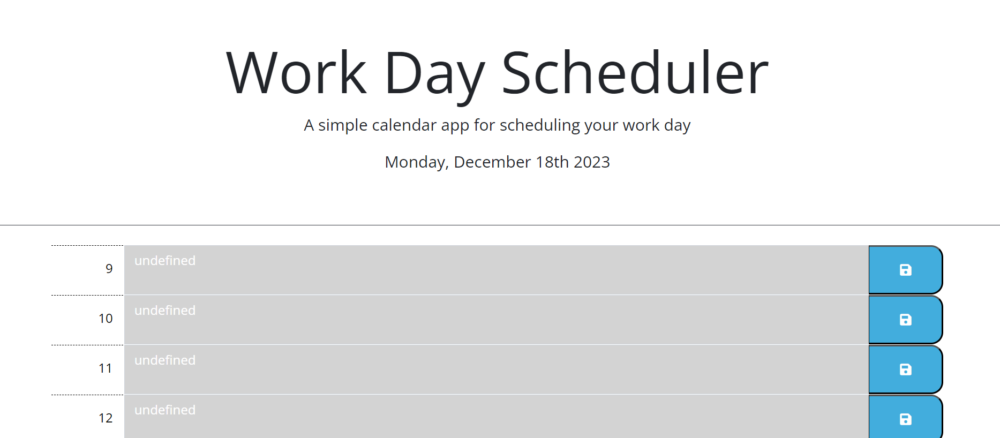

# Work-Day-Scheduler

##Description

This is a Work Day Scheduler for planning out a user's day. The application can be used for an person that would like to type out what tasks they need to complete each hour from 9:00am to 5:00pm. A user can type in each entry box and save their input with the save icon on the side or each bar. If a user closes the app and re-opens it, they will see their last tasks saved. The app has an internal clock that keeps track of what hour in the day it is. The current hour is marked in red, past in gray, and future in green. With this application a user can plan out their day!

To access, copy the repository in github, then use the git clone function in command line to clone this repository into your local machine.

##Usage

link below:

https://devbelle.github.io/Work-Day-Scheduler/

##Credits

All commits and changes to this assignment were implemented by Devin Belle

##License N/A

##Features

Scheduler includes entry boxes for a user to save their input into local storage as well as a built in clock to keep track of what time it currently is. 

##Tests

Entries can be saved into local storage and color choice dictactes the time. 
